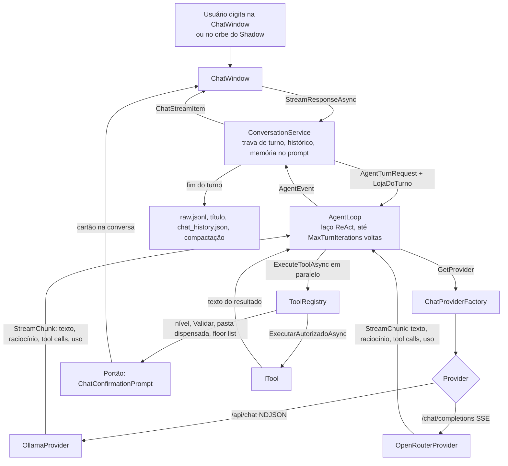

# 01 — Arquitetura

Visão geral do AIB: o que ele é, como a solução está dividida, onde cada coisa nasce e por onde passa uma mensagem do usuário. Os detalhes de cada parte estão nos documentos seguintes; este aqui é o mapa.

## O que é o AIB

O AIB é um assistente de IA para desktop Windows, escrito em C# sobre .NET 8 e WPF. Ele vive na bandeja do sistema e abre uma janela de conversa pelo atalho global `Ctrl+Shift+Space`, pelo ícone da bandeja ou pelo orbe do Shadow (opcional). A conversa é com um **agente**: o modelo pode chamar ferramentas que leem, procuram, gravam e editam arquivos, rodam comandos de shell, executam skills instaladas pelo usuário e consultam os e-mails triados.

Características que moldam o resto do código:

- **Dois provedores de modelo**, e só dois: o Ollama local (`http://127.0.0.1:11434`, API nativa `/api/chat`) e o OpenRouter na nuvem (`https://openrouter.ai/api/v1`). Ver `AIBWindows/Services/ProvedoresDeIa.cs`.
- **Portão humano**: ferramenta que altera a máquina pede confirmação num cartão dentro da conversa antes de rodar.
- **Memória hierárquica em disco**: a conversa crua é gravada inteira e nunca apagada; o que vai ao modelo é resumido em capítulos, atos e fatos.
- **Vigia de e-mail**: um serviço de fundo lê caixas IMAP, em modo somente leitura, e faz a triagem com o modelo.
- **Personagens**: a IA fala com a voz de uma persona (`SOUL.MD`), escolhida pelo usuário.
- **Níveis**: o usuário ganha XP a cada turno concluído; o nível libera ferramentas e aumenta o orçamento de memória.

## Projetos

Não há arquivo `.sln`: cada projeto é construído pelo seu `.csproj`.

| Projeto | Pasta | O que é |
|---|---|---|
| `AIB` | `AIBWindows/AIB.csproj` | O aplicativo. `net8.0-windows10.0.19041.0`, WPF e WinForms ligados, publicado como executável único e self-contained para `win-x64`. Copia `character/**` para junto do executável. |
| `AIB.Tests` | `AIB.Tests/AIB.Tests.csproj` | Suíte xUnit + FluentAssertions (+ Moq). Referencia o projeto do app. Ver [08-testes-e-avaliacao.md](08-testes-e-avaliacao.md). |
| `AIB.Avaliacao` | `AIB.Avaliacao/AIB.Avaliacao.csproj` | Console que mede o prompt contra o modelo de verdade, caso a caso, sem executar ferramentas. Ver [08-testes-e-avaliacao.md](08-testes-e-avaliacao.md). |

Dependências relevantes do app: `Hardcodet.NotifyIcon.Wpf` (bandeja), `NHotkey.Wpf` (atalho global), `MailKit` (IMAP), `Markdig.Wpf` (Markdown nas bolhas), `Microsoft.ML.Tokenizers` com `O200kBase` (contagem de tokens), `System.Security.Cryptography.ProtectedData` (DPAPI) e `OpenAI`. Do pacote `OpenAI` o código usa só os **tipos** (`ChatMessage`, `ChatTool`, `ChatToolCall`); as requisições aos dois provedores são HTTP direto, feitas pelos providers do AIB.

## Composition root: `App.xaml.cs`

O AIB não usa container de injeção de dependência. Todos os serviços de vida longa são construídos **uma vez**, com `new`, em `App.OnStartup` (`AIBWindows/App.xaml.cs`), e passados pelo construtor a quem precisa. A ordem importa:

1. `DirectoryService.EnsureDirectories()` — as pastas de `~/.AIB` existem antes de qualquer leitura.
2. `SettingsService` — nasce **depois** de `EnsureDirectories`, para enxergar o caminho certo das configurações.
3. `RegistroDeExecucao.Iniciar` — o espelho do console em arquivo (opt-in) liga o mais cedo possível, porque o que se precisa depurar costuma acontecer no arranque.
4. `DirectoryService.ApplyFromSettings` e `SettingsService.InvalidateCache` — se as configurações apontam outra pasta de dados, o cache antigo deixa de valer.
5. Os serviços do agente, nesta ordem:

| Objeto | Papel |
|---|---|
| `ChatConfirmationPrompt` | O portão humano. Até a janela de chat se conectar (e depois que ela morrer), recusa tudo. |
| `ToolRegistry(confirmationPrompt, settingsService)` | Registro das ferramentas nativas e execução com o portão. |
| `TokenCounter` | Tokenizador único do processo (criar um é caro). |
| `RegexToolCallHealer` | Recupera chamadas de ferramenta que modelos pequenos escrevem como texto. |
| `ChatProviderFactory(httpClient, healer)` | Entrega o provider (Ollama ou OpenRouter) conforme as configurações, com cache por combinação. |
| `AgentLoop(toolRegistry, providerFactory, settingsService, tokenCounter)` | O laço ReAct. |
| `ConversationService(settings, toolRegistry, agentLoop, tokenCounter, providerFactory)` | Dona do histórico da conversa e da memória. |
| `ChatWindow(conversation, settingsService)` | A janela de conversa; é também `MainWindow`. |

6. `_confirmationPrompt.Conectar(_chatWindow.PerguntarConfirmacaoAsync)` — a partir daqui o portão tem onde perguntar.
7. `MailDigestService` (o vigia de e-mail), com um `MailKitMailService` e a mesma fábrica de providers. Nasce **sempre**; a chave "Deixar o Shadow tratar os e-mails" (`ShadowHandlesMail`) é lida a cada batida, para ligar e desligar valer sem reiniciar. Os eventos dele chegam fora da thread de interface e são repassados ao orbe por `Dispatcher.BeginInvoke`. `Reconstituir()` roda antes de `Iniciar()`, para a tela abrir com o que já foi triado.
8. O orbe do Shadow (`ShadowAssistantWindow`), só se `ShadowAssistantEnabled` estiver ligado.
9. Ícone da bandeja, menu, atalho global.
10. `ConversationService.StartWarmupAsync()` — o aquecimento do modelo, só depois que a UI existe, nunca de dentro de um construtor.

Um único `HttpClient` (timeout infinito; quem controla o tempo é o cancelamento) serve à fábrica de providers e é descartado em `OnExit`.

Outras decisões que moram no `App`:

- **Uma porta só para o chat**: `App.AlternarChat` atende o atalho, o item "Abrir Chat" e o clique no ícone. Ela checa o primeiro arranque (`NeedsFirstRun`: sem provedor escolhido, ou provedor com chave sem a chave **dele** no cofre) e abre a `FirstRunWindow` em vez do chat. Três portas com a checagem copiada já divergiram antes.
- **Um lugar só para o estado do orbe**: `App.SincronizarOrbe` (exposto como `App.AplicarEstadoDoOrbe` para a tela de configurações). O orbe some enquanto o chat está visível — o `App` escuta `IsVisibleChanged` da janela em vez de cada gesto.
- **O orbe não roda turno próprio**: `orbe.MensagemEnviada` chama `ChatWindow.AbrirComMensagem(texto, mostrarJanela: false)`, e a janela de chat roda o turno inteiro escondida; `ChatWindow.TurnoConcluido` devolve o texto final ao orbe. Duas implementações de turno divergiriam em quem grava o quê.
- **`MainWindow` explícito**: sem isso o WPF elegeria a primeira janela criada, que pode ser a `FirstRunWindow` já fechada.
- `App.xaml` declara `ShutdownMode="OnExplicitShutdown"`: fechar a janela de chat não encerra o programa, só o "Sair" da bandeja.

## Mapa de `AIBWindows/`

| Pasta | Conteúdo |
|---|---|
| `Services/` | A lógica. Serviços transversais: `ConversationService` (conversa, memória, arquivamento), `ToolRegistry` e `Ferramentas` (nomes das ferramentas), `SettingsService`/`UserAppSettings`, `ProvedoresDeIa` (provedores, perfis, limites), `DirectoryService`, `CredentialService`, `LevelService`, `AuditLogService`, `ChatHistoryService`, `ActionLogService` e `ContextService` (o que o painel lateral mostra), `SkillService`, `CommandFloorList`, `PastasSemConfirmacao`, `AlwaysAllowSession`, `ChatTitler`, `TokenCounter`, `RegistroDeExecucao`. |
| `Services/Agent/` | O turno: `AgentLoop`, `AgentEvent`, `IMessageStore` e `EphemeralMessageStore`, `WarmupService`, `PromptPrefixTracker`, `PulsoDoTurno`. |
| `Services/Ai/` | Os provedores: `IChatProvider`, `ChatProviderFactory`, `OllamaProvider` (+ `OllamaNativeClient`, que fica em `Services/`), `OpenRouterProvider`, `CatalogoDoOpenRouter`, `ChannelSplitter`, `ChatTemplateSanitizer`, `RegexToolCallHealer`, `StreamChunk`, `ChatRequestOptions`, `RetratoDoEnvio`. |
| `Services/Memory/` | A memória: `SessionMemory` (arquivos da sessão), `Compactor` (capítulos e atos), `MemoryLayer`, `FactStore`, `ArtifactExtractor`, `Pendencia`, `EstadoDoTrecho`, `RegistroDaCompactacao` e os tipos `Turn`, `TurnRecord`, `Chapter`, `Act`. |
| `Services/Mail/` | O e-mail: `MailDigestService` (o vigia), `MailKitMailService` (IMAP), `TriadorDeEmail`, `DiarioDeTriagem`, `ArquivoDeConversas`, `ConversasIgnoradas`, `EstadoDasCaixas`, `RegrasDoVigia`, `VigiasDoEmail`, `MailVault`. |
| `Services/Tools/` | As ferramentas (`ITool`): `ReadFileTool`, `WriteFileTool`, `EditFileTool`, `GlobTool`, `GrepTool`, `RunCommandTool`, `ExecuteSkillTool`, `ConsultarEmailsTool`, `LerEmailTool`, e auxiliares (`PreVooDeCaminho`, `PathArgumentRepair`, `EscritaNoComando`). |
| `Views/` | As janelas e controles: `ChatWindow` (+ `ChatWindow.Email.cs`, o modo e-mail), `SidePanelWindow`, `ToolChainView`, `ConfirmCardView`, `ConfirmDialog`, `SettingsWindow`, `FirstRunWindow`, `ShadowAssistantWindow`, `MailListItem`. |
| `Ui/` | Peças de interface sem regra de negócio: conversores, ícones desenhados (`ToolIcons`, `FileTypeIcons`), `MarkdownPipelines`, `ShrinkWrap`, `FlowDocumentMeasure`, `PincelDoTema`. |
| `Themes/` | `Cores.Escuro.xaml` e `Cores.Claro.xaml` (as cores, um por tema), `Tokens.xaml` (tamanhos, raios, fontes) e `Controls.xaml` (estilos, mescla o `Tokens.xaml`). `Ui/Tema.Carregar` põe as cores e depois os estilos no App, no arranque. |
| `character/` | Os personagens que acompanham a instalação (`Ayano`, `Ellen`, `Kai`, `Sora`), cada um com `SOUL.MD` e `info.json`. É a cópia de fábrica; a verdade fica em `~/.AIB/character`. Ver [07-configuracoes-e-dados.md](07-configuracoes-e-dados.md). |

Alguns arquivos em `Services/` são esqueletos sem comportamento, mantidos porque têm chamadores na interface: `MemoryService`, `OcrService`, `ShadowHistoryService`, `VoiceService`, `ShadowAssistantService`, `ReminderService` (este diz no comentário que quem for implementar lembretes começa apagando-o). `Views/ContextSidebar` está marcado como painel antigo, sem chamador.

## O caminho de uma mensagem

Em palavras:

1. **Janela.** `ChatWindow` chama `ConversationService.StreamResponseAsync(texto, Console.Write)` e consome os `ChatStreamItem` que voltam (texto, "pensando", início e fim de ferramenta, quebra de segmento). A interface é detalhada em [06-interface.md](06-interface.md).
2. **Conversa.** `ConversationService` serializa os turnos com um `SemaphoreSlim` (dois streams nunca intercalam escritas no histórico), calcula o nível do usuário, remonta a mensagem de memória (fatos, atos, capítulos e arquivos anexados), acrescenta a fala do usuário e monta um `AgentTurnRequest` com as ferramentas liberadas para o nível (`ToolRegistry.GetActiveTools`). Toda leitura do histórico devolve cópia, sob um lock único.
3. **Laço.** `AgentLoop.RunAsync` é um iterador assíncrono: a cada volta pega o provider na fábrica, manda o snapshot do histórico e as ferramentas, recebe o stream já classificado em `StreamChunk`, e, se o modelo pediu ferramentas, executa o lote em paralelo pelo `ToolRegistry`, anexa os resultados e volta ao modelo. Termina quando o modelo responde sem pedir ferramenta ou quando bate o teto de voltas (`UserAppSettings.MaxTurnIterations`, 18 por padrão) — e o corte é avisado na tela, nunca silencioso. O laço não tem estado mutável por turno. Ver [02-turno-e-provedores.md](02-turno-e-provedores.md).
4. **Provedor.** `OllamaProvider` e `OpenRouterProvider` falam HTTP, separam o canal final do raciocínio, limpam tokens de template e agregam as chamadas de ferramenta. Ver [02-turno-e-provedores.md](02-turno-e-provedores.md).
5. **Ferramentas e portão.** `ToolRegistry.ExecuteToolAsync` confere o nível, roda `ITool.Validar` (chamada impossível não vira pergunta), decide entre dispensa por pasta de confiança e cartão de confirmação, aplica a floor list de comandos destrutivos, grava a auditoria **antes** de executar e captura qualquer exceção como texto `ERRO…`. Ver [03-ferramentas-e-portao.md](03-ferramentas-e-portao.md).
6. **Fim do turno.** Ainda dentro da trava de turno, `ConversationService` grava o turno em `raw.jsonl`, dá título à conversa depois do primeiro turno, arquiva a conversa em `chat_history.json` a cada turno e, se o turno terminou inteiro, compacta a memória quando a cota passa do gatilho. Ver [04-memoria.md](04-memoria.md).

O e-mail entra por dois lados: o vigia (`MailDigestService`) roda sozinho e deixa o diário da triagem em disco, e a conversa só **lê** esse diário, pela ferramenta `mail` e pelo resumo do vigia no prompt. Ver [05-email.md](05-email.md).

## Threads

- A camada de serviço usa `ConfigureAwait(false)`. `ConversationService` captura o `SynchronizationContext` da UI na construção e devolve seus eventos para ele antes de chegarem à interface.
- Eventos de serviços de fundo (o vigia) chegam fora da thread de interface; quem os liga à tela usa `Dispatcher.BeginInvoke`, como faz o `App`.
- Os providers nunca voltam ao Dispatcher e nunca alteram a lista de mensagens recebida.

## Onde continuar

| Documento | Assunto |
|---|---|
| [02-turno-e-provedores.md](02-turno-e-provedores.md) | `AgentLoop`, providers, stream, aquecimento, cache de prefixo |
| [03-ferramentas-e-portao.md](03-ferramentas-e-portao.md) | `ITool`, as ferramentas, o portão de confirmação, floor list, auditoria |
| [04-memoria.md](04-memoria.md) | Sessões, capítulos, atos, fatos, compactação |
| [05-email.md](05-email.md) | Vigia, triagem, IMAP, conversa sobre um e-mail |
| [06-interface.md](06-interface.md) | Janelas, painel, orbe, temas |
| [07-configuracoes-e-dados.md](07-configuracoes-e-dados.md) | `~/.AIB`, configurações, cofres, níveis, personagens |
| [08-testes-e-avaliacao.md](08-testes-e-avaliacao.md) | `AIB.Tests` e `AIB.Avaliacao` |
